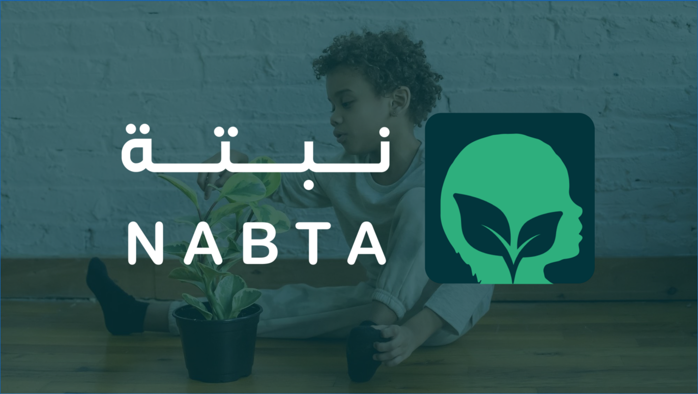

# Nabta Center

This project was developed as part of a database course at [El Shorouk Academy]. The Nabta Center aims to provide rehabilitative services for children with special needs. The project is implemented using C# and Windows Forms.

## About Nabta Center

The Nabta Center initiative was started a few months ago with the goal of offering rehabilitative services for children with special needs. Our mission is rooted in social responsibility towards this category of children, and we are committed to providing these services to help realize the dream of Nabta.

## Vision

At Nabta Center, our vision is to provide the best rehabilitation services for children with disabilities and their families. We strive to **empower** these children to overcome life's challenges and become integrated members of the community.

## Mission

Our mission is to **improve the quality of life for children** through rehabilitation and evaluation methods. We aim to support and guide their potential for learning while providing an **interactive and culturally integrated environment** that suits the community we serve.

## Objectives

- Creating a supportive and stimulating educational environment for children physically, intellectually, and emotionally, commensurate with the different abilities of children through the availability of a sensory room.
- Providing **early detection services** for children with early childhood disorders.
- Actively contribute to societal change and preventive interventions that **improve the health** of children with early childhood disorders.
- Supporting planning ideas and conducting research in the field of early childhood disorders.

